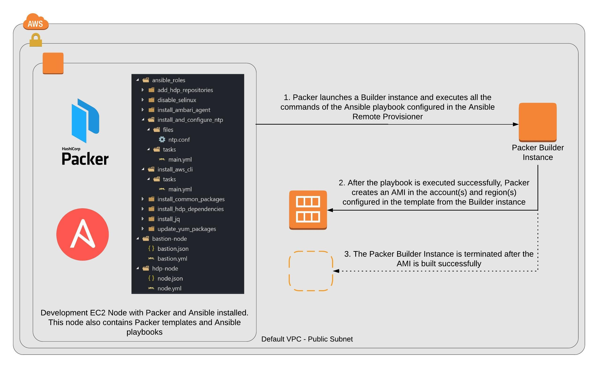

# ansible-packer-provisioner
This project shows the usage of the Packer's Anisble Provisioner to create AMIs on AWS</br>

Using golden AMIs to provision AWS infrastructure has several advantages like reduction in setup time, deterministic deploy process, ease in rolling out software updates and patches, among others.</br>
Packer provides a convenient intergration with Ansible to create AMIs. You can reference your Ansible roles directly within the Packer config file.</br>
This is the outline of the process:</br>


This project shows how to create AMIs for Hortonworks Data Platform. There are several Ansible roles defined which can be used by different playbooks. Here's the yml for the HDP node playbook:
```yml
---
- hosts: all
  gather_facts: no
  roles:
    - update_yum_packages
    - install_common_packages
    - install_and_configure_ntp
    - install_aws_cli
    - install_jq
    - disable_selinux
    - add_hdp_repositories
    - install_hdp_dependencies
    - install_ambari_agent
```

This yml file can be referenced in the corresponding Packer config JSON file using the Ansible provisioner:</br>
```json
"provisioners":[
        {
            "type": "ansible",
            "playbook_file": "./node.yml",
            "ansible_env_vars": [ "ANSIBLE_ROLES_PATH=../ansible_roles" ]
        }
    ]
```
